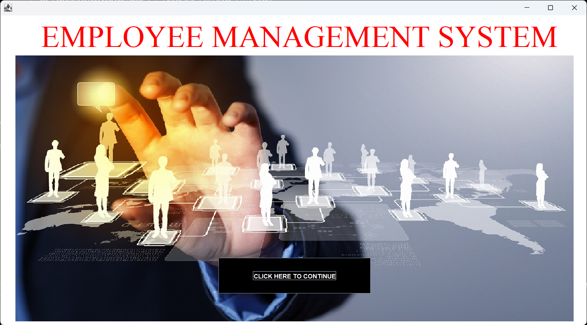
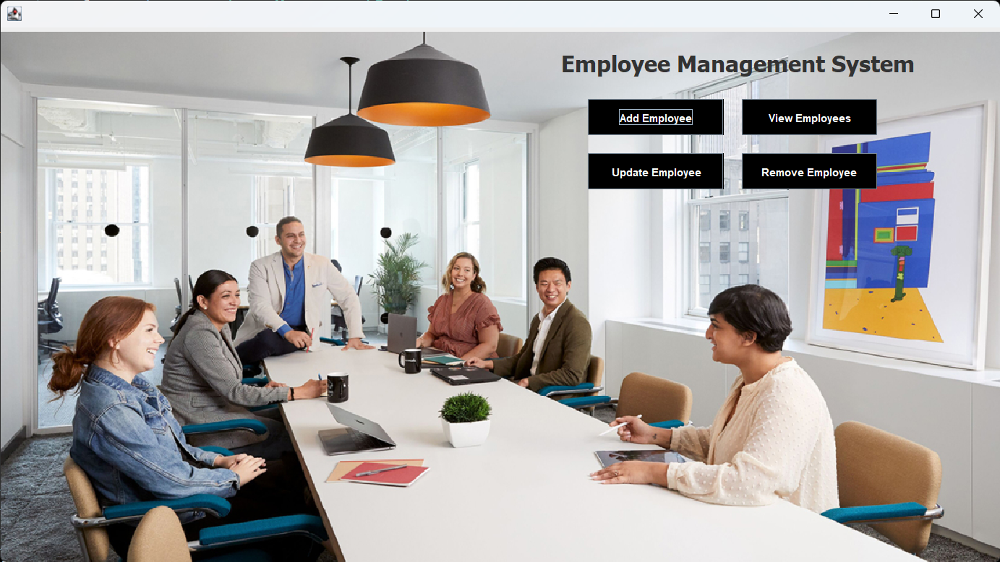
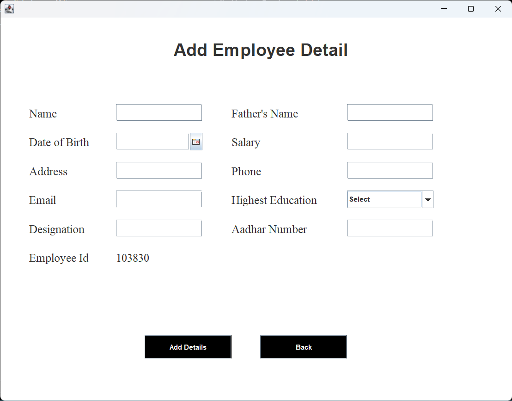
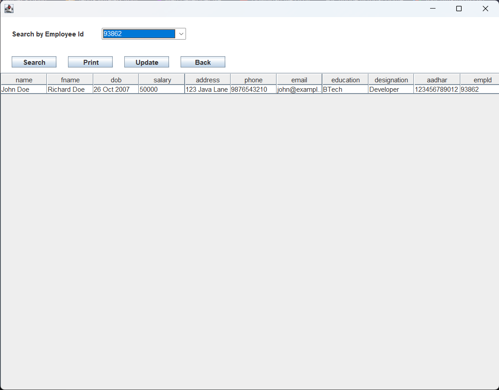
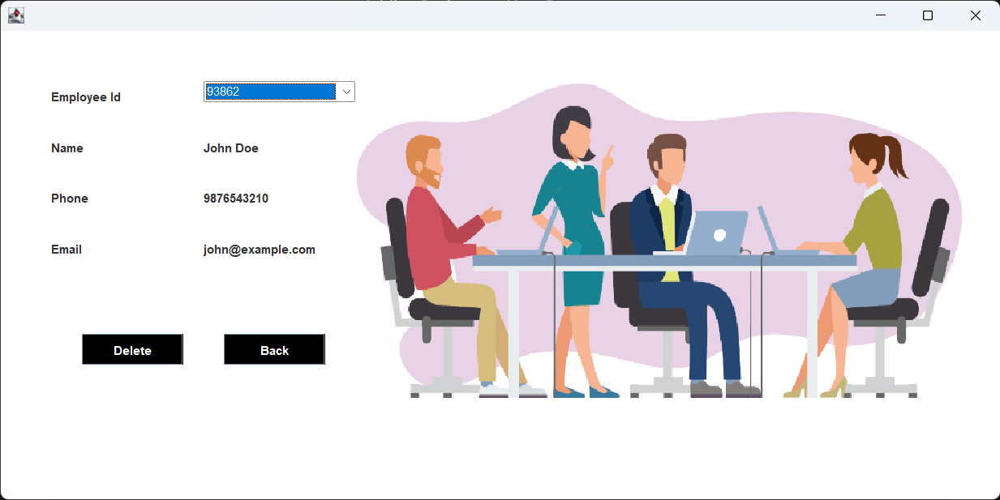

# Employee Management System (EMS)

## 📌 Overview

A comprehensive desktop application developed in Java Swing to streamline Human Resource tasks. This system allows administrators to securely manage employee records with full **CRUD (Create, Read, Update, Delete)** capabilities.

## 🛠️ Tech Stack

- **Frontend:** Java Swing, AWT
- **Backend:** Core Java
- **Database:** MySQL 8.0
- **Tools:** VS Code, SQLyog, JDBC

## 📸 Project Screenshots

### 1. Login Screen

_Secure admin authentication with database validation._

### 2. Home Dashboard

_Central hub for navigation to all administrative features._

### 3. Add Employee

_Form interface with date pickers and dropdowns to onboard new staff._

### 4. View Employees

_Tabular display of all records with search functionality._

### 5. Remove Employee

_Interface to securely delete employee records from the database._

## ✨ Key Features

- **Secure Authentication:** Admin login with database validation.
- **Employee Management:** Add, View, Update, and Remove employee details.
- **Search Functionality:** Filter employees by unique Employee ID.
- **Data Persistence:** All records are stored permanently in a MySQL database.

## 🚀 How to Run Locally

### 1. Database Setup

1.  Install MySQL Server.
2.  Open the file `database_setup.sql` included in this repository.
3.  Run the SQL script in your SQL client (e.g., SQLyog or Workbench) to create the database and tables.

### 2. Application Setup

1.  Open the project in **VS Code** or **Eclipse**.
2.  Add the JAR files from the `lib` folder to your project's **Referenced Libraries** (Classpath).
3.  Run `Splash.java` as the main class.

### 3. Login Credentials

- **Username:** admin
- **Password:** 12345
